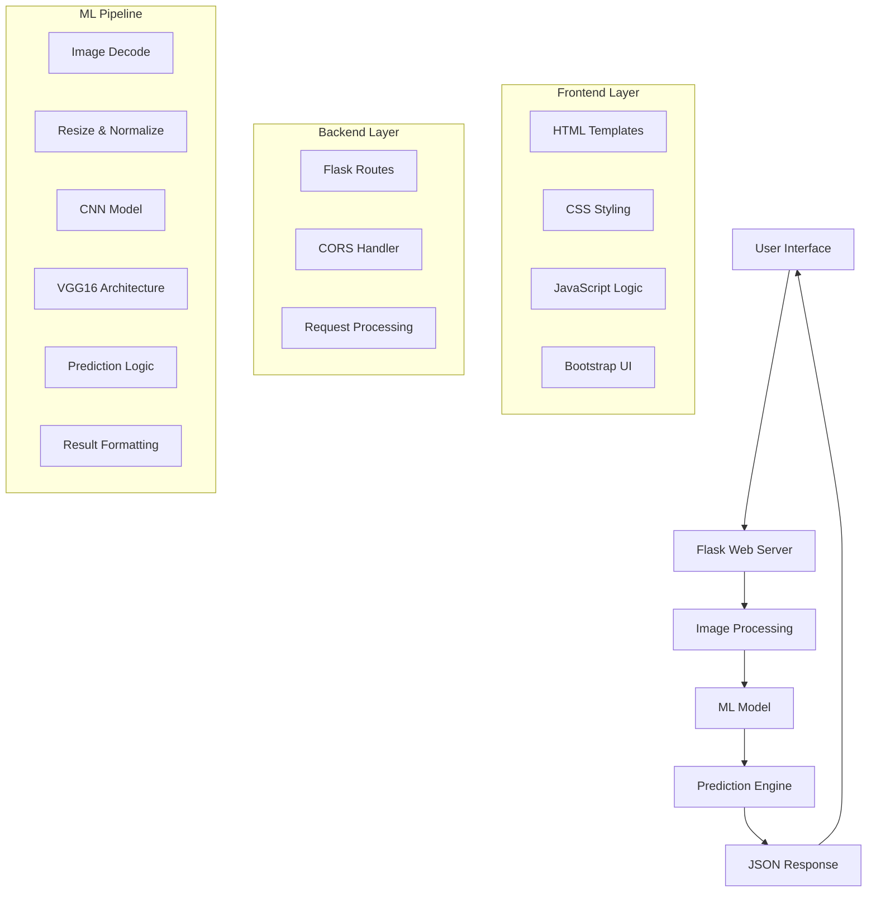
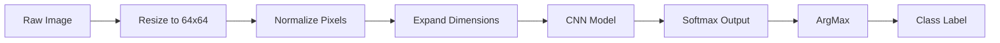
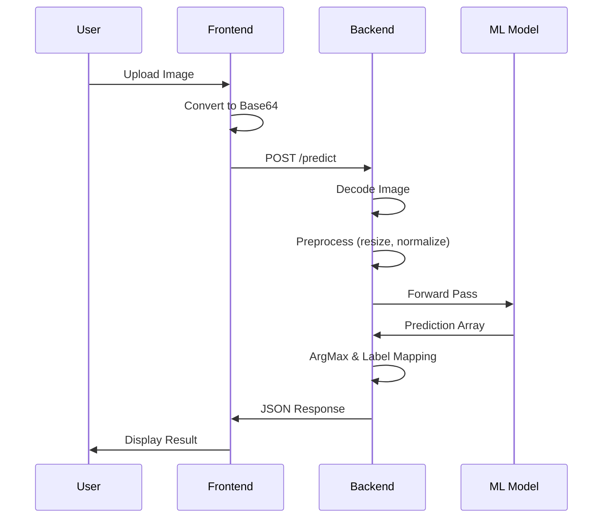

# 🐱🐶 Cat-Dog Classification Web Application

[](https://opensource.org/licenses/MIT)
[](https://www.python.org/downloads/)
[](https://tensorflow.org/)
[](https://flask.palletsprojects.com/)

A deep learning-powered web application that classifies uploaded images as either cats or dogs using a trained Convolutional Neural Network (CNN). The application provides an intuitive web interface for real-time image classification with support for both file uploads and camera capture.

## 📋 Table of Contents

- [Overview](#overview)
- [Features](#features)
- [Technology Stack](#technology-stack)
- [Project Architecture](#project-architecture)
- [Installation & Setup](#installation--setup)
- [Usage](#usage)
- [API Documentation](#api-documentation)
- [Model Details](#model-details)
- [Project Structure](#project-structure)
- [Workflow Diagram](#workflow-diagram)
- [Contributing](#contributing)
- [License](#license)

## 🎯 Overview

This project implements an end-to-end machine learning solution for binary image classification (cats vs dogs). Built with Flask for the backend and modern web technologies for the frontend, it demonstrates the integration of deep learning models into web applications for real-world deployment.

**Key Highlights:**
- ✅ Real-time image classification
- ✅ Web-based interface with drag-and-drop upload
- ✅ RESTful API for predictions
- ✅ Support for multiple image formats
- ✅ Responsive design for mobile and desktop
- ✅ Camera integration for live capture

## 🚀 Features

### Core Functionality
- **Image Classification**: Binary classification of cats and dogs with high accuracy
- **Multiple Input Methods**: File upload, drag-and-drop, and camera capture
- **Real-time Processing**: Instant predictions with visual feedback
- **REST API**: JSON-based API for integration with other applications
- **Responsive UI**: Mobile-friendly interface with Bootstrap styling

### Technical Features
- **Model Support**: Compatible with VGG16 and custom CNN architectures
- **Image Preprocessing**: Automatic resizing and normalization
- **Error Handling**: Robust error management and user feedback
- **Cross-Origin Support**: CORS enabled for API access
- **Loading States**: Visual indicators during processing

## 🛠️ Technology Stack

### Backend Technologies
```
🐍 Python 3.7+           - Core programming language
🌶️ Flask 2.0+            - Web framework
🧠 TensorFlow 2.11.0     - Deep learning framework
🖼️ Pillow (PIL)          - Image processing
🔢 NumPy                  - Numerical computations
🌐 Flask-CORS             - Cross-origin resource sharing
```

### Frontend Technologies
```
🌐 HTML5                  - Markup language
🎨 CSS3                   - Styling and animations
⚡ JavaScript (ES6+)      - Client-side logic
🎨 Bootstrap 4.0          - UI framework
📱 Responsive Design      - Mobile compatibility
📷 WebRTC                 - Camera integration
```

### Development Tools
```
📦 pip                    - Package management
🔧 setuptools             - Package building
📝 Git                    - Version control
🚫 .gitignore             - File exclusion rules
```

## 🏗️ Project Architecture



## 📦 Installation & Setup

### Prerequisites
- Python 3.7 or higher
- pip package manager
- 4GB+ RAM (recommended for model loading)
- Web browser with JavaScript enabled

### Step 1: Clone Repository
```bash
git clone https://github.com/your-username/Cat-Dog-Classification.git
cd Cat-Dog-Classification
```

### Step 2: Create Virtual Environment
```bash
# Create virtual environment
conda create -n catdog python=3.7 -y

# Activate environment
conda activate catdog

# Alternative using venv
python -m venv catdog-env
source catdog-env/bin/activate  # On Windows: catdog-env\Scripts\activate
```

### Step 3: Install Dependencies
```bash
# Install required packages
pip install -r requirements.txt

# Install project in development mode
pip install -e .
```

### Step 4: Download Model
```bash
# Create model directory
mkdir -p model

# Download trained model (replace with actual model file)
# Place your trained model as 'model/model.h5'
```

### Step 5: Run Application
```bash
python app.py
```

### Step 6: Access Application
Open your browser and navigate to: `http://localhost:8080`

## 💻 Usage

### Web Interface

1. **Upload Image**: Click "Upload" button or drag-and-drop an image
2. **Camera Capture**: Use device camera for real-time capture
3. **Predict**: Click "Predict" button to classify the image
4. **View Results**: See prediction results in the right panel

### Supported Formats
- JPEG (.jpg, .jpeg)
- PNG (.png)
- WebP (.webp)
- BMP (.bmp)

### Example Usage Flow
```
1. User visits http://localhost:8080
2. Uploads cat/dog image
3. Clicks "Predict" button
4. System processes image
5. Returns prediction: {"image": "cat"} or {"image": "dog"}
```

## 📡 API Documentation

### Prediction Endpoint

**POST** `/predict`

Classifies an uploaded image as cat or dog.

#### Request Format
```json
{
    "image": "base64_encoded_image_string"
}
```

#### Response Format
```json
[
    {
        "image": "cat"
    }
]
```

#### Example cURL Request
```bash
curl -X POST http://localhost:8080/predict \
  -H "Content-Type: application/json" \
  -d '{"image": "iVBORw0KGgoAAAANSUhEUgAAAAEAAAABCAYAAAAfFcSJAAAADUlEQVR42mP8/5+hHgAHggJ/PchI7wAAAABJRU5ErkJggg=="}'
```

#### Status Codes
- `200 OK`: Successful prediction
- `400 Bad Request`: Invalid image format
- `500 Internal Server Error`: Model loading error

## 🧠 Model Details

### Architecture Options

#### Option 1: VGG16 Transfer Learning
```python
# Model: model_vgg16.h5
Input Shape: (224, 224, 3)
Architecture: VGG16 + Custom Classifier
Classes: 2 (Cat=0, Dog=1)
```

#### Option 2: Custom CNN
```python
# Model: model.h5  
Input Shape: (64, 64, 3)
Architecture: Custom CNN
Classes: 2 (Cat=0, Dog=1)
```

### Model Pipeline


### Training Data
- **Source**: Available via [Google Drive Link](https://drive.google.com/drive/folders/1BZu43nUFJ-h-mhrSYuTDuxuPNeOoYk2J?usp=sharing)
- **Format**: Labeled images of cats and dogs
- **Preprocessing**: Resized, normalized, and augmented

## 📁 Project Structure

```
Cat-Dog-Classification/
├── 📄 README.md                 # Project documentation
├── 📄 LICENSE                   # MIT License
├── 📄 requirements.txt          # Python dependencies
├── 📄 setup.py                  # Package configuration
├── 📄 .gitignore               # Git ignore rules
├── 🐍 app.py                   # Main Flask application
├── 📁 prediction/              # Prediction module
│   ├── 📄 __init__.py         
│   └── 🐍 predict.py          # Model prediction logic
├── 📁 templates/               # HTML templates
│   └── 📄 index.html          # Main web interface
├── 📁 static/                  # Static assets
│   └── 📁 css/
│       ├── 📄 main.css        # Basic styling
│       └── 📄 style.css       # Advanced styling
├── 📁 model/                   # ML models directory
│   ├── 📄 model.h5            # Custom CNN model
│   └── 📄 model_vgg16.h5      # VGG16 model (gitignored)
└── 📁 notebooks/               # Development notebooks
    └── 📄 data-link.txt       # Training data link
```

## 🔄 Workflow Diagram



## 🎨 UI Components

### Main Interface Features
- **Upload Section**: Drag-and-drop with file picker
- **Camera Section**: Live video feed with capture
- **Prediction Panel**: Results display with formatting
- **Loading States**: Spinner during processing
- **Responsive Design**: Mobile and desktop support

### Styling Framework
- **Bootstrap 4.0**: Grid system and components
- **Custom CSS**: Enhanced styling and animations
- **Font Awesome**: Icons and visual elements
- **Google Fonts**: Typography enhancement

## 🔧 Configuration

### Environment Variables
```bash
# Optional: Set Flask configuration
export FLASK_ENV=development
export FLASK_DEBUG=True
export FLASK_APP=app.py
```

### Model Configuration
```python
# In predict.py
MODEL_PATH = "model/model.h5"        # Custom CNN
# MODEL_PATH = "model/model_vgg16.h5" # VGG16 model
INPUT_SIZE = (64, 64)                # Custom CNN
# INPUT_SIZE = (224, 224)            # VGG16 model
```

## 🚀 Deployment Options

### Local Development
```bash
python app.py
# Access: http://localhost:8080
```

### Production Deployment
```bash
# Using Gunicorn
pip install gunicorn
gunicorn -w 4 -b 0.0.0.0:8080 app:app

# Using Docker (create Dockerfile)
FROM python:3.7-slim
COPY . /app
WORKDIR /app
RUN pip install -r requirements.txt
EXPOSE 8080
CMD ["python", "app.py"]
```

## 🧪 Testing

### Manual Testing
1. Test image upload functionality
2. Verify camera capture works
3. Check prediction accuracy
4. Test API endpoints
5. Validate responsive design

### API Testing
```bash
# Test prediction endpoint
curl -X POST http://localhost:8080/predict \
  -H "Content-Type: application/json" \
  -d '{"image": "base64_image_data"}'
```

## 🤝 Contributing

1. **Fork** the repository
2. **Create** your feature branch (`git checkout -b feature/AmazingFeature`)
3. **Commit** your changes (`git commit -m 'Add some AmazingFeature'`)
4. **Push** to the branch (`git push origin feature/AmazingFeature`)
5. **Open** a Pull Request

### Development Guidelines
- Follow PEP 8 coding standards
- Add comments for complex logic
- Test new features thoroughly
- Update documentation as needed

## 📝 License

This project is licensed under the MIT License - see the [LICENSE](LICENSE) file for details.

```
MIT License
Copyright (c) 2023 BAPPY AHMED
```

## 🙏 Acknowledgments

- **TensorFlow Team** for the deep learning framework
- **Flask Community** for the web framework
- **Bootstrap Team** for the UI components
- **iNeuron** for project inspiration and guidance

## 📞 Support

If you encounter any issues or have questions:

1. Check the [Issues](https://github.com/your-username/Cat-Dog-Classification/issues) page
2. Create a new issue with detailed description
3. Include system information and error logs
4. Contact: query@ineuron.ai

---

**Happy Classifying! 🐱🐶**
